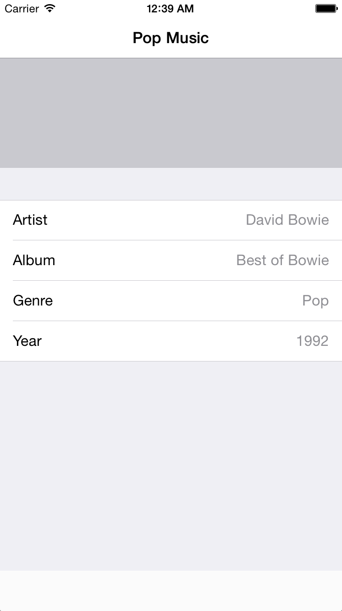

## 如何使用委托模式

打开 `ViewController.swift` 文件，添加如下私有变量：

```swift
private var allAlbums = [Album]()
private var currentAlbumData : (titles:[String], values:[String])?
private var currentAlbumIndex = 0
```

在 `viewDidLoad` 里面加入如下内容：

```swift
override func viewDidLoad() {
    super.viewDidLoad()
    //1
    self.navigationController?.navigationBar.translucent = false
    currentAlbumIndex = 0

    //2
    allAlbums = LibraryAPI.sharedInstance.getAlbums()

    // 3
    // the uitableview that presents the album data
    dataTable.delegate = self
    dataTable.dataSource = self
    dataTable.backgroundView = nil
    view.addSubview(dataTable!)       
}
```

对上面三个部分进行拆解：

1. 关闭导航栏的透明效果
2. 通过 API 获取所有的专辑数据，记住，我们使用外观模式之后，应该从 `LibraryAPI` 获取数据，而不是 `PersistencyManager` 。
3. 你可以在这里设置你的 `UITablweView` ，在这里声明了 `UITableView` 的 `delegate` 是当前的 `ViewController` 。事实上你用了 XIB 或者 StoryBoard ，可以直接在可视化的页面里拖拽完成。

接下来添加一个新的方法用来更方便的获取数据：

```swift
func showDataForAlbum(albumIndex: Int) {
    // defensive code: make sure the requested index is lower than the amount of albums
    if (albumIndex < allAlbums.count && albumIndex > -1) {
        //fetch the album
        let album = allAlbums[albumIndex]
        // save the albums data to present it later in the tableview
        currentAlbumData = album.ae_tableRepresentation()
    } else {
        currentAlbumData = nil
    }
    // we have the data we need, let's refresh our tableview
    dataTable!.reloadData()
}
```

`showDataForAlbum()` 这个方法获取最新的专辑数据，当你想要展示新数据的时候，你需要调用 `reloadData()` 这个方法，这样 `UITableView` 就会向委托请求数据，比如有多少个 `section` 有多少个 `row` 之类的。

在 `viewDidLoad` 里面调用上面的方法：

```swift
self.showDataForAlbum(currentAlbumIndex)
```

这样应用一启动就会去加载当前的专辑数据。因为 `currentAlbumIndex` 的默认值是 0 ，所以一开始会默认显示第一章专辑的信息。

接下来我们该去完善 `DataSource` 的协议方法了。你可以直接把委托方法写在类里面，当然如果你想让你的代码看起来更整洁一点，则可以放在扩展里。

在文件底部添加如下方法，注意一定要放在类定义的大括号外面，因为这两个家伙不是类定义的一部分，它们是扩展：

```swift
extension ViewController: UITableViewDataSource {
}

extension ViewController: UITableViewDelegate {
}
```

上面就是实现委托的方法 - 你可以把协议想象成是与委托之间的约定，只要你实现了约定的方法，就算是实现了委托。在我们的代码中， `ViewController` 需要遵守 `UITableViewDataSource` 和 `UITableViewDelegate` 的协议。这样 `UITableView` 才能确保必要的委托方法都已经实现了。

在 `UITableViewDataSource` 对应的那个扩展里加上如下方法：

```swift
func tableView(tableView: UITableView, numberOfRowsInSection section: Int) -> Int {
  if let albumData = currentAlbumData {
    return albumData.titles.count
  } else {
    return 0
  }
}

func tableView(tableView: UITableView, cellForRowAtIndexPath indexPath: NSIndexPath) -> UITableViewCell {
  var cell:UITableViewCell = tableView.dequeueReusableCellWithIdentifier("Cell", forIndexPath: indexPath) as UITableViewCell
  if let albumData = currentAlbumData {
    cell.textLabel?.text = albumData.titles[indexPath.row]
      if let detailTextLabel = cell.detailTextLabel {
        detailTextLabel.text = albumData.values[indexPath.row]
      }
  }
  return cell
}
```

`tableView(_:numberOfRowsInSection:)` 返回需要展示的行数，和存储的数据中的 title 的数目相同。

`tableView(_:cellForRowAtIndexPath:)` 创建并且返回了一个单元格，上面有标题和对应的值。

注意：你可以把这些方法直接加在类声明里面，也可以放在扩展里，编译器不会去管数据源到底在哪里，只要能找到对应的方法就可以了。而我们之所以这样做，是为了方便其他人阅读。

此时再构建项目，你可以看到如下内容：



是的，显示成功啦！

