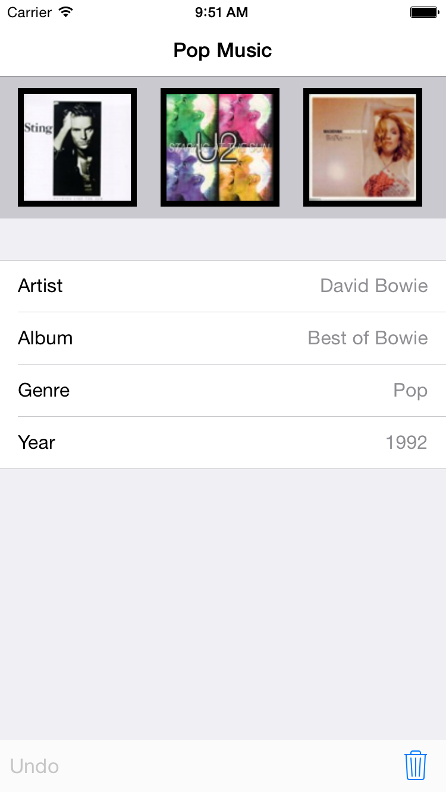

# 最后的润色

现在我们将添加最后一个功能：允许用户删除专辑，以及撤销上次的删除操作。

在 `ViewController` 里添加如下属性：

```swift
// 为了实现撤销功能，我们用数组作为一个栈来 push 和 pop 用户的操作
var undoStack: [(Album, Int)] = []
```

然后在 `viewDidLoad` 的 `reloadScroller()` 后面添加如下代码：

```swift
let undoButton = UIBarButtonItem(barButtonSystemItem: .Undo, target: self, action:"undoAction")
undoButton.enabled = false;
let space = UIBarButtonItem(barButtonSystemItem: .FlexibleSpace, target:nil, action:nil)
let trashButton = UIBarButtonItem(barButtonSystemItem: .Trash, target:self, action:"deleteAlbum")
let toolbarButtonItems = [undoButton, space, trashButton]
toolbar.setItems(toolbarButtonItems, animated: true)
```

上面的代码创建了一个 `toolbar` ，上面有两个按钮，在 `undoStack` 为空的情况下， `undo` 的按钮是不可用的。注意 `toolbar` 已经在 `storyboard` 里了，我们需要做的只是配置上面的按钮。

我们需要在 `ViewController.swift` 里添加三个方法，用来处理专辑的编辑事件：增加，删除，撤销。

先写添加的方法：

```swift
func addAlbumAtIndex(album: Album,index: Int) {
    LibraryAPI.sharedInstance.addAlbum(album, index: index)
    currentAlbumIndex = index
    reloadScroller()
}
```

做了三件事：添加专辑，设为当前的索引，重新加载滚动条。

接下来是删除方法：

```swift
func deleteAlbum() {
    //1
    let deletedAlbum : Album = allAlbums[currentAlbumIndex]
    //2
    let undoAction = (deletedAlbum, currentAlbumIndex)
    undoStack.insert(undoAction, atIndex: 0)
    //3
    LibraryAPI.sharedInstance.deleteAlbum(currentAlbumIndex)
    reloadScroller()
    //4
    let barButtonItems = toolbar.items! as [UIBarButtonItem]
    let undoButton : UIBarButtonItem = barButtonItems[0]
    undoButton.enabled = true
    //5
    if (allAlbums.count == 0) {
        let trashButton : UIBarButtonItem = barButtonItems[2]
        trashButton.enabled = false
    }
}
```

挨个看一下各个部分：

- 获取要删除的专辑。
- 创建一个 `undoAction` 对象，用元组存储 `Album` 对象和它的索引值。然后把这个元组加到了栈里。
- 使用 `LibraryAPI` 删除专辑数据，然后重新加载滚动条。
- 既然撤销栈里已经有了数据，那么我们需要设置撤销按钮为可用。
- 检查一下是不是还剩专辑，如果没有专辑了那就设置删除按钮为不可用。

最后添加撤销按钮：

```swift
func undoAction() {
    let barButtonItems = toolbar.items! as [UIBarButtonItem]
    //1       
    if undoStack.count > 0 {
        let (deletedAlbum, index) = undoStack.removeAtIndex(0)
        addAlbumAtIndex(deletedAlbum, index: index)
    }
    //2       
    if undoStack.count == 0 {
        let undoButton : UIBarButtonItem = barButtonItems[0]
        undoButton.enabled = false
    }
    //3       
    let trashButton : UIBarButtonItem = barButtonItems[2]
    trashButton.enabled = true
}
```

照着备注的三个步骤再看一下撤销方法里的代码：

- 首先从栈里 `pop` 出一个对象，这个对象就是我们当初塞进去的元祖，存有删除的 `Album` 对象和它的索引位置。然后我们把取出来的对象放回了数据源里。
- 因为我们从栈里删除了一个对象，所以需要检查一下看看栈是不是空了。如果空了那就设置撤销按钮不可用。
- 既然我们已经撤消了一个专辑，那删除按钮肯定是可用的。所以把它设置为 `enabled` 。

这时再运行应用，试试删除和插销功能，似乎一切正常了：



我们也可以趁机测试一下，看看是否及时存储了专辑数据的变化。比如删除一个专辑，然后切到后台，强关应用，再重新开启，看看是不是删除操作成功保存了。

如果想要恢复所有数据，删除应用然后重新安装即可。

完成到这一步的Demo：

- [查看源码](https://github.com/yourtion/SwiftDesignPatterns-Demo1/tree/FinalTouches) 
- [下载Zip](https://github.com/yourtion/SwiftDesignPatterns-Demo1/archive/FinalTouches.zip)
